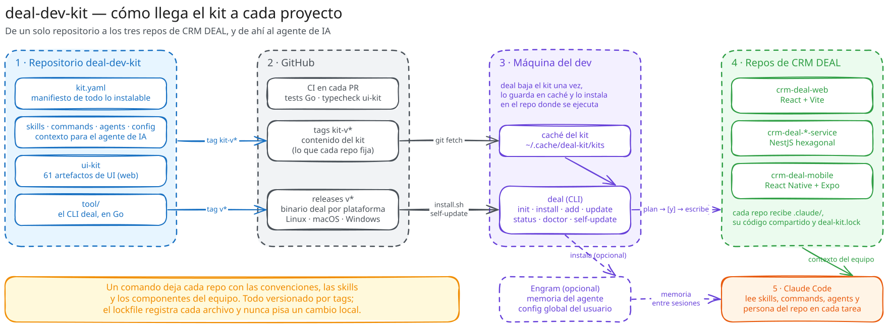

# Qué es deal-dev-kit

**En resumen:** CRM DEAL es un polyrepo con tres tipos de proyecto (backend, web,
mobile). Cada repositorio necesita las mismas convenciones y el mismo contexto
para que un agente de IA trabaje bien en él, y copiar eso a mano diverge en la
primera semana. `deal-dev-kit` es el repo único con ese contenido, más el CLI
`deal` que lo instala y lo mantiene sincronizado.

## El problema

CRM DEAL (Grupo Venado) se organiza como **polyrepo**: un repositorio por
proyecto, tres tipos de proyecto:

| Tipo | Repositorio | Stack |
|---|---|---|
| `backend` | `crm-deal-*-service` | NestJS, hexagonal, 4 capas |
| `web` | `crm-deal-web` | React + Vite, feature-based |
| `mobile` | `crm-deal-mobile` | React Native + Expo, React Native Paper |

Esto crea cuatro problemas concretos:

1. **Cada repo necesita las mismas convenciones** — TypeScript estricto, Conventional
   Commits, dónde va cada capa — y no hay ningún mecanismo que las mantenga
   iguales entre repos una vez que el equipo crece.
2. **El agente de IA necesita contexto del equipo** para no inventar
   convenciones ni ubicar código en la carpeta equivocada. Sin ese contexto
   escrito, cada sesión parte de cero.
3. **Copiar componentes UI a mano diverge.** Un botón copiado hoy y otro
   corregido la semana que viene dejan de ser el mismo componente en dos repos.
4. **Nada de esto se puede mantener sincronizado sin una herramienta.** Un
   documento en Confluence o Notion no fuerza nada: nadie se entera cuándo
   quedó desactualizado.

## Qué es el kit

Un solo repositorio público, `github.com/oliviosubelza/deal-dev-kit`, con dos
partes:

- **Contenido del kit**: skills para el agente de IA, componentes UI (catálogo
  shadcn), commands, agents y configuración siempre activa (persona,
  atribución de commits).
- **`tool/`**: el CLI `deal`, escrito en Go, que instala ese contenido en cada
  proyecto y lo mantiene sincronizado.

El contenido y la herramienta viven en el mismo repo pero se versionan por
separado (ver [`05-versionado-y-distribucion.md`](05-versionado-y-distribucion.md)),
y `tool/` tiene su propio `go.mod`, así que es extraíble a su propio repositorio
con un subtree split si el kit alguna vez necesita ser privado.

## Principios de diseño, con su razón

Cada decisión de abajo está tomada, documentada en `HANDOFF.md` §5, y no se
relitiga sin un motivo nuevo.

| Decisión | Razón |
|---|---|
| Un repo, no dos | El CLI vive en `tool/` con `go.mod` propio; extraíble con subtree split si el kit pasa a privado. |
| Go para el CLI | Cross-compila a binario estático: el equipo no instala ningún runtime. Solo el autor del kit necesita Go. |
| Copiar código fuente, no publicar paquete npm | GitHub Packages exige un token por developer y por CI; un registro npm privado se paga. Además, copiar el fuente evita que Tailwind v4 no escanee `node_modules`. |
| No usar el registry de shadcn | Ese modelo resuelve el diff contra ediciones locales, y en este equipo se decidió que los componentes **no** se editan dentro del proyecto — cualquier arreglo sube upstream. |
| Bubble Tea para la TUI | Ya es convención del equipo (la skill `go-testing` cubre `teatest`). |
| La TUI es una capa sobre `internal/plan` | Nunca decide nada por su cuenta. Si lo hiciera, `--yes` y la TUI podrían terminar haciendo cosas distintas. |
| Solo `y` aplica un plan | `enter` navega hacia la pantalla del plan. Aceptarlo como confirmación permitió, en una máquina real, que dos `Enter` seguidos instalaran 74 archivos sin que nadie lo pidiera. |
| Tabla única de comandos | El despacho y el reconocimiento de nombres salen de la misma tabla (`tool/cmd/deal-kit/commands.go`). Dos veces, en la historia del kit, un comando nuevo cayó silenciosamente al navegador interactivo por tener listas separadas. |
| `--here` es opt-in | Sin él, un `cd` mal tipeado haría crecer archivos donde no corresponde. |
| No hay wizard propio de scaffolding | Se corre el generador oficial no interactivo de cada stack (`create vite`, `@nestjs/cli new`, `create expo-app`). |
| Skills y componentes en pantallas separadas de la TUI | Mezclar una convención de equipo y un botón en la misma lista hace imposible saber qué se está por instalar. |
| Un repo git, dos namespaces de tags | El contenido cambia mucho más seguido que el binario del CLI (ver [`05-versionado-y-distribucion.md`](05-versionado-y-distribucion.md)). |
| Solo lo que la fuente de verdad afirma | Nada de convenciones inventadas ni huecos documentados como si fueran reglas. Si algo no está decidido, se dice que no está decidido. |

## Qué NO es el kit

- No es un paquete npm. Los componentes se copian como código fuente al
  proyecto; el equipo los edita ahí como si fueran propios (con la salvedad de
  que un arreglo local debe subir upstream — ver
  [`04-motor-de-sincronizacion.md`](04-motor-de-sincronizacion.md)).
- No decide arquitectura por su cuenta: documenta la que ya bajó el
  coordinador técnico o los leads de cada área. Donde esa bajada no define
  algo (convención de nombres de archivo, alias de imports, dónde van los
  tests), el kit no lo inventa.
- No reemplaza a Claude Code ni a ningún otro agente: le da el contexto que
  ese agente necesita para trabajar dentro de las convenciones del equipo.

## Siguiente paso

Ver [`02-inventario.md`](02-inventario.md) para el contenido exacto que el kit
tiene hoy, o [`03-cli.md`](03-cli.md) para cómo se instala y se usa.
