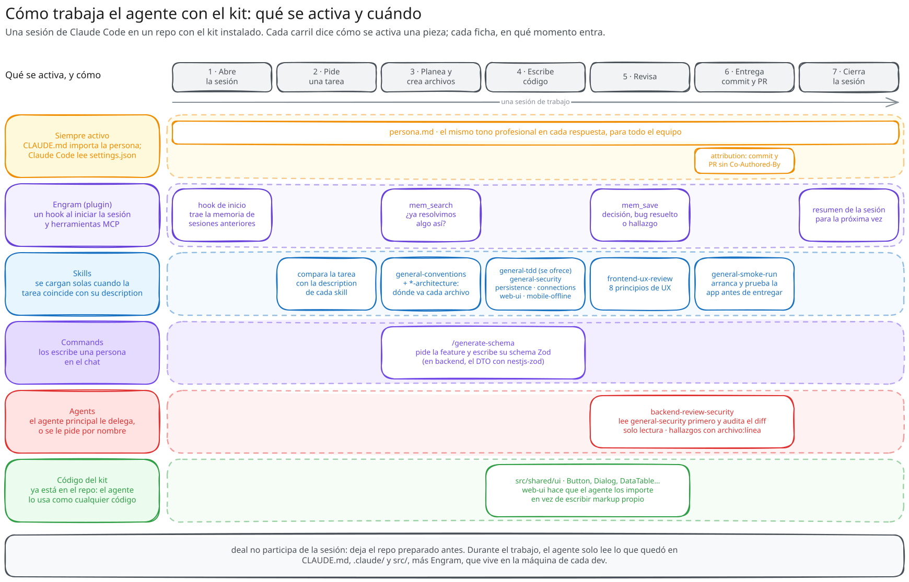
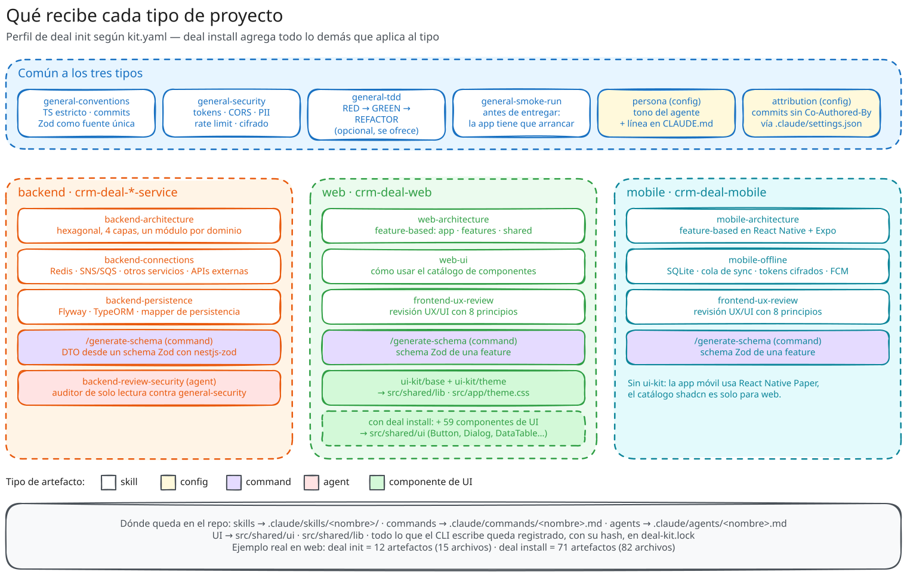

# Inventario: qué tiene el kit hoy

**En resumen:** el kit declara 79 artefactos instalables en `kit.yaml` — 12
skills, 61 componentes UI, 3 commands, 1 agent y 2 configuraciones siempre
activas — repartidos en tres perfiles (backend, web, mobile). Todo lo de esta
página está verificado contra `kit.yaml` (`version: 2`), no contra la
prosa que lo describe.

## Artefactos por tipo

| Tipo | Cantidad | Qué instala |
|---|---|---|
| `skill` | 12 | Un `SKILL.md` que el agente carga cuando su `description` matchea la tarea |
| `component` | 61 | Código fuente de un componente UI (o de una utilidad de soporte) |
| `config` | 2 | Un archivo siempre activo, o una garantía sobre un archivo del proyecto |
| `command` | 3 | Un slash command de Claude Code (`/generate-schema`) |
| `agent` | 1 | Un sub-agente que Claude Code puede invocar |

Cada tipo entra en un momento distinto de la sesión de trabajo. La persona
está activa en cada respuesta; las skills se cargan cuando la tarea coincide
con su `description`; un command lo escribe una persona; un agent lo delega el
agente principal; y los componentes son código que el agente importa.



## Skills

| ID | Nombre instalado | Qué cubre | `applies_to` |
|---|---|---|---|
| `general/conventions` | `general-conventions` | TypeScript estricto, ESLint/Prettier, Conventional Commits, Zod como fuente de verdad, polyrepo trunk-based, ramas ligadas a Jira, sin secretos en código | backend, web, mobile |
| `general/security` | `general-security` | TTL y scopes de tokens, rotación de refresh, CORS, geoblocking, rate limiting, masking de PII, TLS/AES-256 | backend, web, mobile |
| `general/tdd` | `general-tdd` | Test-first opcional: RED-GREEN-REFACTOR, y pruebas de eventos SNS/SQS entre módulos | backend, web, mobile |
| `general/smoke-run` | `general-smoke-run` | Arrancar la app de verdad antes de decir "listo": build, boot en background, probe HTTP, teardown | backend, web, mobile |
| `backend/architecture` | `backend-architecture` | Capas hexagonales de un microservicio NestJS: domain, application, infrastructure, interface | backend |
| `backend/connections` | `backend-connections` | Dónde vive cada tipo de conexión (Redis, SNS/SQS, servicios, webhooks, streams) | backend |
| `backend/persistence` | `backend-persistence` | Flyway manda el schema; TypeORM lo espeja; el dominio no conoce ninguno de los dos | backend |
| `web/architecture` | `web-architecture` | Estructura feature-based de `crm-deal-web`: app, features, shared | web |
| `web/ui` | `web-ui` | El catálogo de UI compartido instalado en `src/shared/ui` (shadcn sobre Base UI + Tailwind v4), más `DataTable` y `FilterBar` | web |
| `mobile/architecture` | `mobile-architecture` | Estructura feature-based de `crm-deal-mobile`, incluida navegación, storage seguro, notificaciones | mobile |
| `mobile/offline` | `mobile-offline` | Comportamiento offline-first: SQLite, cola de sync, token cifrado, push FCM | mobile |
| `frontend/ux-review` | `frontend-ux-review` | Lente de revisión UX/UI en ocho principios (Hick, Miller, KISS, minimalismo, etc.), con hallazgos anclados a `file:line` | web, mobile |

El id del artefacto **no restringe** `applies_to`: `frontend/ux-review` aplica a
web y mobile a pesar de su prefijo, porque nada en el código relaciona uno con
el otro (`tool/internal/kit/manifest.go`). El prefijo es organización del
repositorio, no una regla.

## Commands

| ID | Se invoca como | Qué hace | `applies_to` |
|---|---|---|---|
| `backend/generate-schema` | `/generate-schema` | DTO NestJS con `nestjs-zod` en `interface/dto/` | backend |
| `web/generate-schema` | `/generate-schema` | Schema Zod en `features/<feature>/schemas/` | web |
| `mobile/generate-schema` | `/generate-schema` | Schema Zod en `features/<feature>/schemas/` | mobile |

Un `command` se instala con el **nombre hoja** de su id (`generate-schema.md`,
sin el prefijo de grupo), porque el nombre del archivo es lo que un humano
escribe para invocarlo. Una skill o un agent sí se instalan aplanados
(`web-ui`, `backend-review-security`): nadie tipea el nombre de una skill —la
carga el modelo por descripción— ni el de un agent —lo referencia el
orquestador.

## Agents

| ID | Nombre instalado | Qué hace | `applies_to` |
|---|---|---|---|
| `backend/review-security` | `backend-review-security` | Auditor de solo lectura (`Read, Grep, Glob`) que audita el diff contra la skill `general-security` instalada; reporta hallazgos con severidad y `file:line`. No corre en CI: es interactivo, y nunca emite un token de estado tipo `STATUS: FAILED_*` | backend |

## Config (siempre activo, no una skill)

| ID | Mecanismo | Archivo del proyecto | Qué garantiza |
|---|---|---|---|
| `general/persona` | `ensure_line` | `CLAUDE.md` | Instala `.claude/persona.md` y garantiza la línea `@.claude/persona.md` en `CLAUDE.md`, sin la cual Claude Code nunca carga la persona |
| `general/attribution` | `ensure_json` | `.claude/settings.json` | Fija `attribution.commit` y `attribution.pr` en `""`, la única forma de apagar el trailer `Co-Authored-By: Claude` que el harness agrega por su cuenta |

Ninguno de los dos es una skill porque una skill carga **solo si el modelo
juzga que su descripción matchea la tarea**, y una regla de tono o de
atribución vale para toda respuesta — no puede ser condicional.

## ui-kit: 61 artefactos por grupo

| Grupo | Cantidad | Artefactos |
|---|---|---|
| Foundation | 3 | `base` (lib compartida, `cn` y utilidades), `use-mobile` (hook), `theme` (CSS de tema) |
| Forms & input | 18 | `button-group`, `button`, `calendar`, `checkbox`, `combobox`, `field`, `input-group`, `input-otp`, `input`, `label`, `native-select`, `radio-group`, `select`, `slider`, `switch`, `textarea`, `toggle-group`, `toggle` |
| Overlays | 11 | `alert-dialog`, `command`, `context-menu`, `dialog`, `drawer`, `dropdown-menu`, `hover-card`, `menubar`, `popover`, `sheet`, `tooltip` |
| Data display | 10 | `accordion`, `avatar`, `badge`, `card`, `carousel`, `chart`, `collapsible`, `item`, `table`, `data-table` |
| Layout & utilities | 7 | `aspect-ratio`, `direction`, `kbd`, `portal-container`, `resizable`, `scroll-area`, `separator` |
| Navigation | 6 | `breadcrumb`, `navigation-menu`, `pagination`, `sidebar`, `steps`, `tabs` |
| Feedback | 6 | `alert`, `empty`, `progress`, `skeleton`, `sonnet` (componente toast, sobre la librería `sonner`), `spinner` |

`ui-kit/data-table` es el artefacto con más dependencias del catálogo: requiere
14 otros artefactos (`badge`, `base`, `button`, `calendar`, `checkbox`,
`command`, `dropdown-menu`, `empty`, `input`, `popover`, `separator`,
`skeleton`, `switch`, `tooltip`), así que instalarlo arrastra buena parte del
catálogo transitivamente (ver
[`04-motor-de-sincronizacion.md`](04-motor-de-sincronizacion.md#resolución-transitiva-de-requires)).
`FilterBar` que menciona la skill `web-ui` es una composición documentada en la
skill, no un artefacto separado de `kit.yaml`.

`ui-kit/base` **requiere** `web/ui` (la skill del catálogo): todo componente
depende de `base`, así que instalar cualquier componente enseña también al
agente a usar el catálogo.

Cada componente declara sus dependencias npm en `kit.yaml` (bloque `npm:`), y
`kit.NPMDeps` calcula la unión para toda una instalación. La única excepción es
`react`/`react-dom`: no está en ningún bloque `npm:` porque el `project_type`
`web` ya es React + Vite — el proyecto base, no algo que se instale por
componente. Sí figura en `ui-kit/package.json`, que es privado y solo sirve
para que `tsc --noEmit` corra en CI (ver
[`05-versionado-y-distribucion.md`](05-versionado-y-distribucion.md)).



## Perfiles por tipo de proyecto

`deal init` instala el **perfil** (`kit.yaml` → `profiles`); `deal install`
instala **todo lo que aplica** al tipo. Contados sobre `kit.yaml`:

| Tipo | Perfil (`init`) | Todo lo que aplica (`install`) |
|---|---|---|
| `backend` | 11 artefactos | 11 artefactos — perfil e instalación completa **coinciden**: no hay ui-kit para backend |
| `web` | 12 artefactos (15 archivos) | 71 artefactos (82 archivos) — la diferencia son los 59 componentes ui-kit que el perfil no incluye |
| `mobile` | 10 artefactos | 10 artefactos — coinciden, igual que backend |

Los conteos de `web` están verificados contra el binario real
(`deal init --type web` y `deal install --type web` sobre un proyecto de
prueba, `HANDOFF.md` §26) y de forma independiente contando los artefactos de
`kit.yaml` que aplican a `web` (6 `general/*` + `web/architecture` +
`web/ui` + `frontend/ux-review` + `web/generate-schema` + 61 de ui-kit = 71).

El perfil `web` solo trae dos artefactos de ui-kit: `ui-kit/base` y
`ui-kit/theme` (`ui-kit/use-mobile` no está en el perfil). El resto del
catálogo se instala a demanda con `deal add ui-kit/<componente>`, o todo junto
con `deal install`.

## Qué queda en cada repo

Rutas de destino, resueltas contra las raíces que `kit.yaml` declara por tipo
de proyecto (`project_types.<tipo>.roots`):

```
<repo>/
├── deal-kit.lock                         # qué instaló el CLI, con hash por archivo
├── CLAUDE.md                             # del proyecto; el kit solo garantiza una línea
├── .claude/
│   ├── persona.md                        # general/persona
│   ├── settings.json                     # del proyecto; el kit solo garantiza dos claves
│   ├── skills/
│   │   └── <id-aplanado>/SKILL.md        # p. ej. .claude/skills/web-ui/SKILL.md
│   ├── commands/
│   │   └── <nombre-hoja>.md              # p. ej. .claude/commands/generate-schema.md
│   └── agents/
│       └── <id-aplanado>.md              # p. ej. .claude/agents/backend-review-security.md
└── src/                                  # solo en web/mobile
    ├── shared/ui/<componente>.tsx        # web: catálogo ui-kit
    ├── shared/lib/                       # web: ui-kit/base (cn, utils, storage)
    ├── shared/hooks/use-mobile.ts        # web: ui-kit/use-mobile
    └── app/theme.css                     # web: ui-kit/theme
```

`deal-kit.lock` es el único archivo que el kit escribe y que no aparece en el
árbol de ningún artefacto: lo escribe el motor de sincronización, no un
artefacto de `kit.yaml`. Ver
[`04-motor-de-sincronizacion.md`](04-motor-de-sincronizacion.md) para su
estructura exacta.

## Siguiente paso

[`03-cli.md`](03-cli.md) explica cómo se instala y usa cada uno de estos
artefactos desde el CLI.
