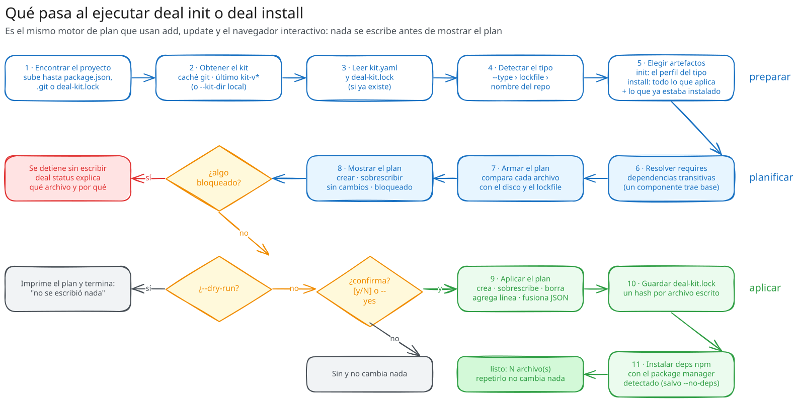
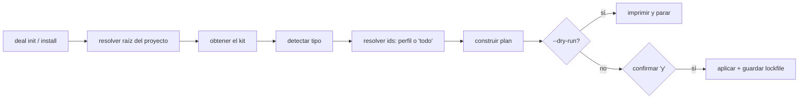

# El CLI `deal`

**En resumen:** `deal` es un binario Go estático, sin runtime que instalar. Un
comando lo instala; ocho subcomandos cubren todo el ciclo: crear, instalar,
agregar, actualizar, diagnosticar y auto-actualizarse. Todo comando que
escribe imprime su plan primero, y `--dry-run` se detiene ahí.

## Instalación

```sh
# Linux, macOS, WSL
curl -fsSL https://raw.githubusercontent.com/oliviosubelza/deal-dev-kit/main/tool/scripts/install.sh | sh

# Windows PowerShell
irm https://raw.githubusercontent.com/oliviosubelza/deal-dev-kit/main/tool/scripts/install.ps1 | iex
```

`install.sh` descarga el binario prebuilt, verifica su checksum SHA-256 contra
`checksums.txt` del mismo release, lo instala como `deal` en `$HOME/.local/bin`
y avisa si ese directorio no está en el `PATH`. No requiere Go.

| Variable de entorno | Qué controla | Default |
|---|---|---|
| `DEAL_VERSION` (o `DEAL_KIT_VERSION`) | Tag del release a instalar | `latest` |
| `DEAL_BIN_DIR` (o `DEAL_KIT_BIN_DIR`) | Directorio de instalación | `$HOME/.local/bin` |
| `DEAL_REPO` (o `DEAL_KIT_REPO`) | Repo del kit contra el que verificar acceso | `oliviosubelza/deal-dev-kit` |

Los nombres `DEAL_KIT_*` siguen aceptándose: el comando se renombró de
`deal-kit` a `deal`, pero romper una variable que ya usa un script de CI no
vale la prolijidad.

## Tabla de comandos

| Comando | Qué hace | Flags propios |
|---|---|---|
| *(ninguno)* | Abre el navegador interactivo (TUI) | — |
| `new <dir>` | Crea el proyecto con su generador oficial y luego instala el kit | `--type` |
| `init` | Detecta el tipo de proyecto e instala su **perfil** | `--type` |
| `install` | Detecta el tipo e instala **todo** lo que le aplica | `--type` |
| `add <id>...` | Instala artefactos adicionales por id | — |
| `update` | Avanza el pin del kit y re-sincroniza lo ya instalado | — |
| `status` | Muestra qué está instalado y si cambió | — |
| `doctor` | Informa qué herramientas externas están instaladas | — |
| `self-update` | Reemplaza este binario por el último release publicado | `--check` |

Flags globales, disponibles en todo comando que toca el kit o el proyecto:

| Flag | Efecto |
|---|---|
| `--repo` | Repositorio del kit (o `DEAL_KIT_REPO`) |
| `--ref` | Tag, branch o SHA del kit (o `DEAL_KIT_REF`); por defecto el `kit-v*` más nuevo |
| `--offline` | Usa el kit en caché sin contactar el remoto |
| `--kit-dir` | Usa un checkout local del kit en lugar de descargarlo (o `DEAL_KIT_DIR`) |
| `--type` | Fuerza el tipo de proyecto en lugar de detectarlo |
| `--here` | Usa el directorio actual como raíz del proyecto (opt-in; ver [`01-que-es.md`](01-que-es.md)) |
| `--dry-run` | Imprime el plan sin escribir nada |
| `--yes` | Aplica sin pedir confirmación |
| `--no-deps` | Omite la instalación de dependencias npm |

La tabla de comandos vive en un único lugar
(`tool/cmd/deal-kit/commands.go`): el despacho y el reconocimiento de nombres
derivan de ahí, así que agregar una fila alcanza para que el comando exista.

## `init` vs `install` vs `add` vs `update`

| Comando | Selecciona |
|---|---|
| `deal init` | `m.Profiles[tipo]` — el perfil que `kit.yaml` declara |
| `deal install` | Todo artefacto con `a.Supports(tipo)` — lo mismo que "Instalar todo" en la TUI |
| `deal add <id>...` | Los ids nombrados; exige que el proyecto ya tenga `deal-kit.lock` |
| `deal update` | Lo que el lockfile ya registra, sin agregar ni quitar artefactos |

`Init` e `Install` son el mismo código (`internal/cli/setup`) con un único
valor distinto — el `scope` que decide qué ids arrancan el cálculo. Los dos
funcionan sobre un proyecto sin lockfile, los dos son aditivos sobre uno que ya
lo tiene, y correr cualquiera de los dos dos veces no escribe nada la segunda
vez.

## Flujos paso a paso





### `init` / `install`

1. Resuelve la raíz del proyecto (sube directorios buscando `package.json`,
   `.git` o `deal-kit.lock`; nunca confunde el propio kit con un proyecto,
   porque el kit también es un repo git).
2. Obtiene el kit: `--kit-dir` usa un checkout local; si no, clona/actualiza el
   kit en caché y hace checkout del `kit-v*` más nuevo (o del `--ref` dado).
3. Detecta el tipo de proyecto por el nombre del directorio contra los
   patrones `match` de `kit.yaml` (o usa `--type`).
4. Resuelve los ids del perfil o de "todo", más lo que el lockfile ya tenía
   instalado (`PartitionInstalled`).
5. Construye el plan (`internal/plan.Build`) y lo imprime.
6. Con `--dry-run` se detiene. Sin `--yes`, pide confirmación (`[y/N]`).
   Si algo quedó `Blocked`, se niega a escribir nada.
7. Aplica el plan, guarda `deal-kit.lock`, e instala dependencias npm con el
   package manager detectado (a menos que `--no-deps`).

### `new` (con los generadores oficiales)

`deal new <dir>` no reimplementa ningún scaffolding: corre el generador
oficial no interactivo de cada stack y después instala el kit dentro.

| Tipo | Generador que corre |
|---|---|
| `web` | `<pm> create vite@latest <dir> --template react-ts` |
| `backend` | `<pm> dlx @nestjs/cli new <dir> --package-manager <pm> --skip-install --skip-git` |
| `mobile` | `<pm> create expo-app <dir> --template blank-typescript --no-install` |

Cada generador se corre con la stdin real de la terminal — en un terminal
interactivo, el usuario contesta las preguntas propias del generador (qué
linter, SDK de Expo, etc.); con stdin cerrada, cada uno toma su default. El
`<pm>` sale de `doctor.ForWeb()`, que prefiere `pnpm` sobre `npm`. Ninguno de
los tres instala sus propias dependencias: el `install` del kit corre
inmediatamente después, en la misma pasada de resolución del package manager.

### `update`

Re-sincroniza exactamente lo que el lockfile ya registraba, sin agregar ni
quitar artefactos. Si algún artefacto cambió upstream, el plan lo muestra como
`overwrite`; si algo se editó localmente, queda `blocked` y el comando se
niega a aplicar nada hasta que se resuelva (ver
[`04-motor-de-sincronizacion.md`](04-motor-de-sincronizacion.md)).

### `status`

Solo lee: construye el mismo plan que un `update` haría y lo reporta, sin
escribir nada. Si el kit disponible es más nuevo que el pin del proyecto, lo
dice y sugiere `deal update`.

### `doctor`

Prueba qué hay en el `PATH`: `git`, `node`, `pnpm`/`npm`, y — solo porque son
herramientas del developer, no del proyecto — `claude` y `engram`. Estos dos
últimos aparecen para los tres tipos de proyecto a propósito, y nunca
bloquean: son opcionales.

### `self-update`

1. Localiza el binario en ejecución (sigue symlinks).
2. Consulta el último release publicado en GitHub.
3. Si la versión instalada es `dev` (build local), exige `--yes` explícito
   para no reemplazar un build de desarrollo por accidente.
4. Con `--check`, solo informa si hay una versión más nueva.
5. Descarga el asset y verifica su checksum SHA-256 contra `checksums.txt` del
   mismo release. Un binario que no verifica nunca se escribe a disco.
6. Reemplaza el binario: lo escribe en un archivo temporal en el mismo
   directorio, mueve el actual a `.old`, renombra el nuevo al lugar del viejo
   (rename es atómico en el mismo filesystem), y si el segundo rename falla,
   **restaura el `.old`** en vez de dejar el directorio sin binario.

### TUI (navegador interactivo)

`deal` sin argumentos, en una terminal real, abre el navegador. Pantallas
(`tool/internal/tui/model.go`):

| Pantalla | Qué muestra |
|---|---|
| Menú | "Instalar todo", Skills y convenciones, Componentes de UI, Estado del proyecto, Engram para Claude Code, Salir — cada línea con su resumen en vivo |
| Skills y convenciones | Lista plana de skills, con lo ya instalado premarcado |
| Componentes de UI | Lista agrupada (Foundation, Forms & input, Overlays...), plegada por defecto |
| Estado del proyecto | Igual que `deal status`; `u` dispara una actualización |
| Engram para Claude Code | Estado del plugin y, si aplica, el plan de instalación; solo `y` lo confirma |
| Plan | El plan calculado, antes de aplicarlo; solo `y` aplica |
| Aplicado / Falló | Resultado final |

La TUI **nunca decide** qué hace un sync — solo junta selección y consentimiento,
y entrega el mismo `internal/plan` que usan los flags no interactivos. Fuera de
una terminal (pipeada o en CI), `deal` sin subcomando falla con un mensaje que
indica usar `init`, `add` o `status` con `--yes`.

## `deal` vs `deal-kit`: por qué los assets de release no se renombraron

El binario que se instala hoy es `deal`, pero los assets de cada release
siguen publicándose como `deal-kit_<os>_<arch>`. No es un descuido: `self-update`
arma el nombre del asset a partir de un literal compilado dentro del binario
(`internal/selfupdate.AssetName()`). Si un release futuro publicara
`deal_<os>_<arch>` en su lugar, todo binario ya instalado dejaría de encontrar
su propia actualización y quedaría varado. El nombre del asset solo puede
cambiar en un release que además mantenga los nombres viejos como alias, y
recién después de que la mayoría del equipo haya pasado por al menos un
`self-update`.

## Siguiente paso

[`04-motor-de-sincronizacion.md`](04-motor-de-sincronizacion.md) explica cómo
se calcula el plan que cada uno de estos comandos imprime y aplica.
