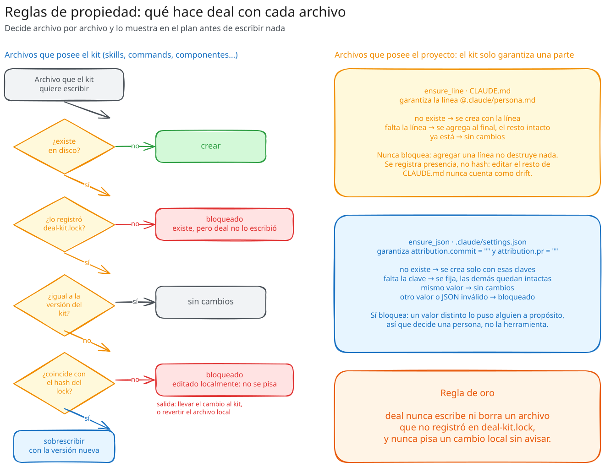
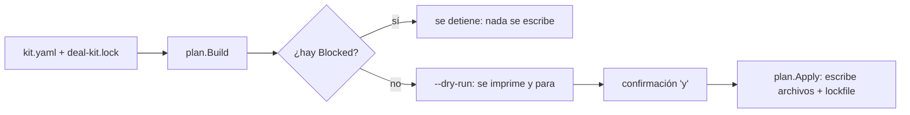
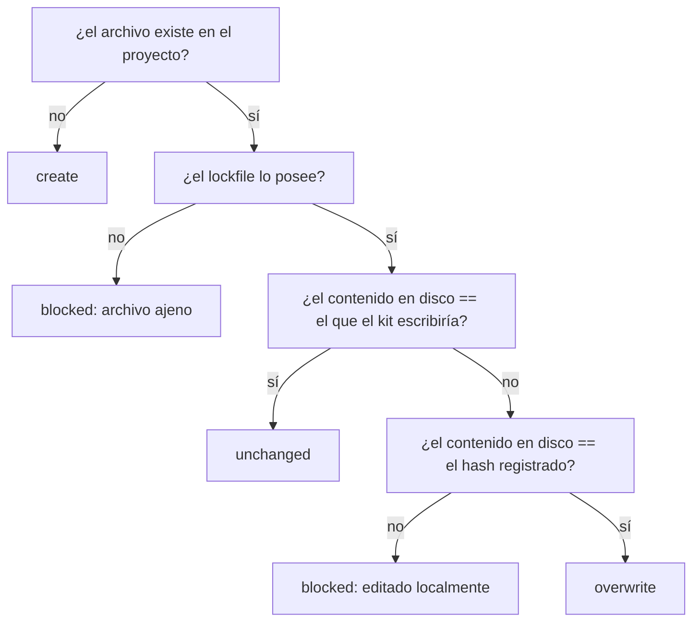

# El motor de sincronización

**En resumen:** todo comando que escribe pasa por `internal/plan`. Un plan
clasifica cada archivo en uno de siete tipos de acción, nunca sobrescribe algo
editado a mano, y correrlo dos veces sobre un proyecto ya sincronizado no
escribe un solo byte. `deal-kit.lock` es la memoria que hace posible esa
clasificación.



## Qué es un plan

Un `Plan` (`tool/internal/plan/plan.go`) es el conjunto completo de acciones
que un sync haría, calculado **sin tocar el proyecto**. Tanto la TUI como los
flags no interactivos construyen el mismo plan a partir de los mismos datos —
artefactos resueltos, lockfile, raíces del proyecto, reglas de reescritura de
imports — así que no hay dos caminos que puedan divergir en qué hacen.



## Los siete `Kind` de una acción

Verificados en `tool/internal/plan/plan.go`:

| `Kind` | Qué significa |
|---|---|
| `create` | El archivo no existe: se crea |
| `overwrite` | El archivo existe, el kit lo posee y cambió upstream: se reemplaza |
| `unchanged` | El archivo ya tiene exactamente los bytes que el kit escribiría: no hay nada que hacer |
| `delete` | El artefacto dejó de producir este archivo (o quedó huérfano): se borra |
| `blocked` | Hace falta una decisión humana antes de escribir nada |
| `append-line` | Garantiza una línea dentro de un archivo que el kit **no** posee |
| `merge-json` | Garantiza claves JSON dentro de un archivo que el kit **no** posee |

## Cómo se clasifica cada archivo

`classify()` decide en este orden exacto (el orden es la parte que importa —
ver la nota de convergencia más abajo):



| Situación | Resultado |
|---|---|
| El archivo no existe | `create` |
| Existe, pero nadie en `deal-kit.lock` lo posee | `blocked` — es del proyecto |
| El kit lo posee, y el contenido en disco ya coincide con el que el kit escribiría | `unchanged` — aunque el lockfile tenga un hash viejo (ver más abajo) |
| El kit lo posee, el contenido cambió respecto del hash registrado | `blocked` — editado localmente desde que el kit lo escribió |
| El kit lo posee, el contenido coincide con el hash registrado, pero el kit trae una versión nueva | `overwrite` |

**Convergencia primero que contabilidad.** Hasta una corrección documentada en
`HANDOFF.md` §17, el chequeo del hash del lockfile corría *antes* que el de
igualdad de contenido, así que un archivo arreglado a mano en el proyecto y
después subido upstream —exactamente el flujo que la skill `web-ui` le pide al
equipo— quedaba `blocked` con el motivo "editado localmente", aunque los bytes
en disco ya fueran los correctos. Ahora la igualdad de contenido gana: si los
bytes ya son los que el kit quiere, no hay nada que sobrescribir ni que
perder, y el lockfile se autocorrige con el hash nuevo la próxima vez que
`Apply` corre.

**`Apply` se niega a escribir nada mientras haya algo `blocked`.** Un solo
archivo con un conflicto congela el sync completo, incluidos artefactos que no
tienen nada que ver — es la garantía de que nunca se aplica una sincronización
parcial silenciosa.

## `deal-kit.lock`

Formato YAML en la raíz del proyecto (`tool/internal/lockfile/lockfile.go`):

```yaml
kit_version: kit-v0.9.0
project_type: web
roots:
  ui: src/shared/ui
  ...
artifacts:
  - id: web/ui
    files:
      - { path: .claude/skills/web-ui/SKILL.md, hash: <sha256> }
  - id: general/persona
    files:
      - { path: .claude/persona.md, hash: <sha256> }
    lines:
      - { path: CLAUDE.md, line: "@.claude/persona.md" }
  - id: general/attribution
    files: []
    json:
      - { path: .claude/settings.json, key: attribution.commit, value: '""' }
      - { path: .claude/settings.json, key: attribution.pr, value: '""' }
```

| Campo | Para qué |
|---|---|
| `files[].hash` | SHA-256 de lo que el CLI escribió. Un mismatch en el disco es la señal de "un humano editó esto" |
| `lines[]` | Presencia (no hash) de una línea garantizada en un archivo que el proyecto posee |
| `json[]` | Presencia y **valor** (no hash) de una clave garantizada en un JSON que el proyecto posee |

El CLI nunca escribe ni borra una ruta que no esté en este archivo.

## `ensure_line` vs `ensure_json`: por qué uno nunca bloquea y el otro sí

Ambos existen para el mismo problema: algunos artefactos solo funcionan si un
archivo que el kit **no posee** — `CLAUDE.md`, `.claude/settings.json` — tiene
un dato concreto. Copiar el archivo entero destruiría lo que el proyecto ya
tenía ahí, así que en vez de eso el kit garantiza solo una porción.

| Mecanismo | Archivo de ejemplo | Qué garantiza | Cuando el archivo no está | Cuando ya tiene otro valor |
|---|---|---|---|---|
| `ensure_line` | `CLAUDE.md` | Una línea literal (`@.claude/persona.md`) | Se crea con esa línea | No aplica — una línea no tiene "otro valor", o está o no está |
| `ensure_json` | `.claude/settings.json` | Un conjunto de claves con su valor (`attribution.commit: ""`) | Se crea con esas claves | **`blocked`**, nombrando la clave |

La diferencia es deliberada: agregar una línea al final de un archivo no
destruye nada, así que `AppendLine` **nunca** puede quedar bloqueado — es el
único `Kind` con esa garantía. Una clave JSON es distinta: si ya tiene otro
valor, alguien lo puso a propósito, y pisarlo revertiría en silencio una
decisión del proyecto. No hay merge honesto entre dos respuestas distintas a
la misma pregunta, así que decide una persona.

Las dos comparten el resto del diseño:

- Se trackea **presencia, no contenido** — hashear `CLAUDE.md` o
  `settings.json` haría que `status` reportara "cambiado" en cada corrida,
  porque el equipo los edita todo el día por razones ajenas al kit. Un status
  que siempre grita entrena a la gente a no leerlo.
- Etiqueta propia en `status`: `FALTA IMPORT` para `ensure_line`, `FALTA AJUSTE`
  para `ensure_json` — contestan la pregunta útil ("¿sigue la línea / la clave
  ahí?"), no la engañosa ("¿cambió el archivo?").
- Quitar lo que se garantizó queda fuera de alcance: si el artefacto se
  desinstala, el registro desaparece del lockfile pero la línea o la clave
  quedan en el archivo del proyecto. Editar un archivo ajeno para sacarle algo
  es una decisión más peligrosa que agregarlo.
- `ensure_json` compara **hoja por hoja**, no el objeto completo: así un
  proyecto que agregó una tercera clave dentro de `attribution` no entra en
  conflicto por una clave que al kit no le importa. Un codec JSON propio
  (`internal/plan/jsondoc.go`) preserva el orden de las claves del archivo —
  decodificar a un `map` genérico las alfabetizaría todas y produciría un diff
  ilegible.

## Reescritura de imports

Los componentes del ui-kit se escriben contra el layout del propio kit
(`@/components/ui/...`), pero se instalan en la ruta del proyecto
(`src/shared/ui/...`). `import_rewrites` en `kit.yaml` mapea cada prefijo, con
la regla de que **el prefijo más específico gana** cuando dos podrían aplicar:

```yaml
import_rewrites:
  web:
    "@/components/ui/": "@/shared/ui/"
    "@/hooks/": "@/shared/hooks/"
    "@/lib/": "@/shared/lib/"
```

Esto asume que el proyecto mapea `@/` a `src/` en su configuración de alias —
un supuesto documentado, no verificado contra un `crm-deal-web` real porque
ese repositorio todavía no existe.

## Resolución transitiva de `requires`

`Manifest.Resolve` expande los ids pedidos siguiendo `requires` de forma
transitiva, con detección de ciclos, y devuelve el resultado **ordenado con
las dependencias primero** — instalable tal cual sale. Pedir
`ui-kit/data-table` arrastra sus 14 dependencias declaradas sin que el usuario
tenga que nombrarlas.

## Dependencias npm y detección del package manager

`kit.NPMDeps` calcula la unión de los bloques `npm:` de los artefactos
resueltos. `internal/pm.Detect` identifica pnpm/npm/yarn/bun por el lockfile
presente en el proyecto (más confiable que preguntar), y si ninguno hay,
revisa el campo `packageManager` de `package.json`. Sin ninguna señal, el CLI
imprime el comando de instalación para correrlo a mano en vez de adivinar.

## Artefactos huérfanos

Un artefacto que el lockfile registra pero que `kit.yaml` ya no declara queda
**huérfano** (`Manifest.PartitionInstalled`). `update` borra sus archivos y su
entrada del lockfile — salvo que hayan divergido localmente, en cuyo caso
quedan `blocked` con el mismo criterio que cualquier otro archivo editado a
mano.

Este caso **no** es el mismo que un proyecto sin `deal-kit.lock`, o que ya
tiene componentes copiados a mano de un `ui-kit` viejo: ahí el CLI ve archivos
que nunca escribió y se niega a tocarlos, correctamente, pero hoy no hay forma
de decirle "esto es tuyo, registralo sin reescribir nada" — es `deal
adopt`, que sigue pendiente (ver [`07-guia-de-demo.md`](07-guia-de-demo.md#estado-honesto)).

## Convergencia

Correr `init`, `install` o `update` dos veces seguidas sobre el mismo proyecto
no escribe un solo byte la segunda vez: todo queda `unchanged`, y el comando
imprime `ya está actualizado`. Es la propiedad que hace seguro correr estos
comandos en CI o repetirlos sin pensar.

## Siguiente paso

[`05-versionado-y-distribucion.md`](05-versionado-y-distribucion.md) explica
de dónde sale la versión del kit que este motor compara, y cómo se publica.
