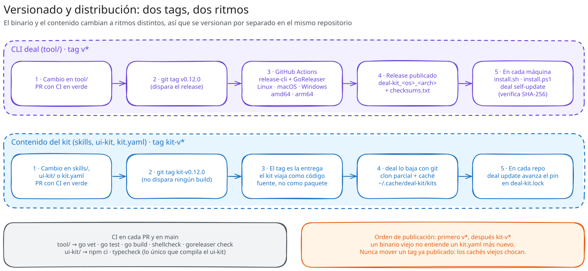

# Versionado y distribución

**En resumen:** el binario y el contenido del kit se versionan con dos
namespaces de tags independientes porque cambian a ritmos distintos. El CLI
siempre se publica primero. El contenido del kit no tiene ningún pipeline de
CI: es un tag git que el propio CLI lee directamente.

## `v*` vs `kit-v*`

| Tag | Versiona | Qué dispara |
|---|---|---|
| `v1.2.0` | El binario del CLI (todo lo que está bajo `tool/`) | GoReleaser publica binarios en un GitHub Release |
| `kit-v1.4.0` | El contenido del kit (`skills/`, `ui-kit/`, `kit.yaml`) — lo que un proyecto fija en `deal-kit.lock` | Nada en CI — es un tag git liso que `internal/kit.Fetch` lee directamente |

El filtro del workflow de release es literalmente `on: push: tags: ["v*"]`,
así que un `kit-v*` nunca lo dispara. La razón de fondo: un tag con prefijo
tipo `cli/v1.0.0` necesitaría la configuración `monorepo` de GoReleaser Pro,
que es de pago; dos namespaces sin `/` evitan ese costo.

## Orden de publicación: primero el CLI

Cuando un cambio toca los dos lados — por ejemplo, una capacidad nueva del
motor de sincronización (`ensure_json`) más el artefacto de `kit.yaml` que la
usa (`general/attribution`) — **el tag `v*` se publica antes que el
`kit-v*`**. Un binario más viejo que el cambio ignora en silencio el campo
nuevo del manifiesto: instalaría la mitad de lo que el artefacto promete sin
avisar. Publicar primero el binario le da a cada proyecto la chance de correr
`deal self-update` antes de que exista un `kit-v*` que su versión anterior no
sabría leer del todo.

`kit.yaml` declara su propio `version: 2` (subió al agregar los tipos
`command` y `agent`), y el CLI acepta las versiones `1` y `2` — así que sigue
leyendo kits pineados en tags viejos.

## Trampa: mover un tag ya publicado

`Fetch` cachea un clon por repositorio. Un tag que se mueve en el remoto choca
con lo que el caché ya tiene: sin el `--force` que el fetch usa hoy, `git
fetch --tags` se negaba a adoptarlo y **todo** comando fallaba con `exit
status 1` sin explicación — incluido `status`, que solo lee. Pasó de verdad
con `kit-v0.2.0`. Ya está corregido en el binario (`git fetch --tags --force
--prune --prune-tags`), pero una máquina con un CLI anterior a la corrección
sigue rota hasta que borra su caché a mano
(`~/.cache/deal-kit/kits/<slug>-<hash>` en Linux/macOS,
`%LocalAppData%\deal-kit\kits\<slug>-<hash>` en Windows). La lección operativa:
preferir cortar un tag nuevo antes que mover uno ya publicado.

## Qué hace CI

`.github/workflows/ci.yml` corre en cada pull request y en cada push a `main`,
con dos jobs independientes:

| Job | Qué corre |
|---|---|
| `tool` | `go vet ./...`, `go test ./...`, `go build ./...`, `shellcheck scripts/install.sh`, y `goreleaser check` — para que una configuración de release rota falle en el PR, no al cortar el tag |
| `ui-kit` | `npm ci` + `npm run typecheck` (`tsc --noEmit`) sobre los `.ts`/`.tsx` de `ui-kit/` |

El job `ui-kit` es, en palabras del propio workflow, "lo único que compila" ese
código: el kit se distribuye copiando fuente, así que nada más en la cadena de
distribución pasa esos archivos por un compilador antes de que un proyecto los
instale. `ui-kit/package.json` es privado (`"private": true`, sin build ni
publish) y existe solo para que `tsc` tenga con qué correr en CI; sus
`devDependencies` se derivan de los bloques `npm:` de `kit.yaml` más `react`,
`react-dom` y `typescript`, así que compila contra las mismas versiones que
los proyectos instalan.

`repo_manifest_test.go` y `repo_skills_test.go` (dentro del job `tool`) validan
`kit.yaml` y la prosa de las skills contra el código real en cada corrida —
sin necesitar ningún cableado extra de CI, porque `go test ./...` ya recorre
todo el árbol del repositorio con paths relativos.

## `release-cli.yml` + GoReleaser

Se dispara solo con push de un tag `v*`. Corre `goreleaser release --clean`
contra `tool/.goreleaser.yaml`:

| Configuración | Valor |
|---|---|
| Binario | `deal` (`CGO_ENABLED=0`, cross-compilado) |
| Plataformas (`goos`) | `linux`, `darwin`, `windows` |
| Arquitecturas (`goarch`) | `amd64`, `arm64` |
| Formato de archivo | Binario suelto, no archivo comprimido — `install.sh` descarga un solo archivo directamente |
| Nombre del asset | `deal-kit_<os>_<arch>` (ver más abajo por qué no cambió a `deal_*`) |
| Checksums | `checksums.txt`, SHA-256 |

## Cómo se obtiene el kit

`internal/kit.Fetch` (`tool/internal/kit/fetch.go`):

1. Resuelve un directorio de caché estable por repositorio:
   `UserCacheDir()/deal-kit/kits/<slug-del-repo>-<sha256(repo)[:8]>`.
2. Si no hay clon ahí, hace un **clon blobless**
   (`git clone --filter=blob:none`) — trae el historial liviano y el contenido
   de los archivos bajo demanda.
3. Si ya hay clon y no es `--offline`, hace `git fetch --tags --force --prune
   --prune-tags` — el caché es un espejo descartable, el remoto manda.
4. Hace checkout del ref: `--ref` explícito, o el `kit-v*` más nuevo por
   orden de versión (`git tag --list "kit-v*" --sort=-v:refname`). Sin
   ningún `kit-v*` en el repo, cae al `HEAD` del branch por defecto.
5. `--offline` usa exclusivamente lo que ya está en caché; sin caché previo,
   falla explícitamente en vez de intentar una descarga.
6. `--kit-dir` evita todo lo anterior: apunta directo a un checkout local, que
   es como se prueban cambios al propio kit antes de taggear.

## `self-update` con checksum y rollback

1. Localiza el binario en ejecución (sigue symlinks, para actualizar en el
   lugar aunque la instalación sea un link).
2. Consulta `GET /repos/<repo>/releases/latest` de la API de GitHub.
3. Descarga el asset y `checksums.txt` del mismo release; calcula el SHA-256
   del binario descargado y lo compara contra la línea correspondiente. Un
   binario que no verifica **nunca se escribe a disco**.
4. Reemplaza el binario en tres pasos atómicos por filesystem: escribe el
   nuevo binario en un archivo temporal en el mismo directorio, renombra el
   binario actual a `.old`, renombra el temporal al nombre final. Si ese
   último rename falla, **restaura el `.old`** en vez de dejar el directorio
   sin binario ejecutable — es el rollback.

## Por qué los assets se siguen llamando `deal-kit_<os>_<arch>`

El binario que se instala hoy es `deal`, pero los assets publicados conservan
el nombre viejo. No es un descuido: `self-update` arma el nombre del asset que
va a descargar a partir de un **literal compilado dentro del binario**
(`selfupdate.AssetName()`). Un binario instalado hoy busca
`deal-kit_<os>_<arch>`; si un release futuro publicara `deal_<os>_<arch>` en
su lugar, ese binario no encontraría su propia actualización y quedaría
varado, sin salida automática. El nombre del asset solo puede cambiar en un
release que además mantenga los nombres viejos como alias, y solo después de
que la mayoría del equipo haya pasado por al menos un `self-update` — nunca en
un PR suelto.

Dos consecuencias del mismo origen:

- `self-update` reemplaza el binario en su lugar y **nunca lo renombra**. Una
  instalación anterior al rename de `deal-kit` a `deal` se queda con el
  nombre viejo en disco; para pasar a `deal` hay que correr el instalador de
  nuevo y borrar el archivo viejo (el instalador detecta que sigue en el
  `PATH` y lo señala).
- `DEAL_KIT_VERSION` se sigue aceptando junto a `DEAL_VERSION`, por scripts de
  CI ya escritos contra el nombre anterior.

## Siguiente paso

[`06-engram.md`](06-engram.md) cubre la única instalación que este CLI hace
**fuera** del proyecto y fuera de `kit.yaml`.
