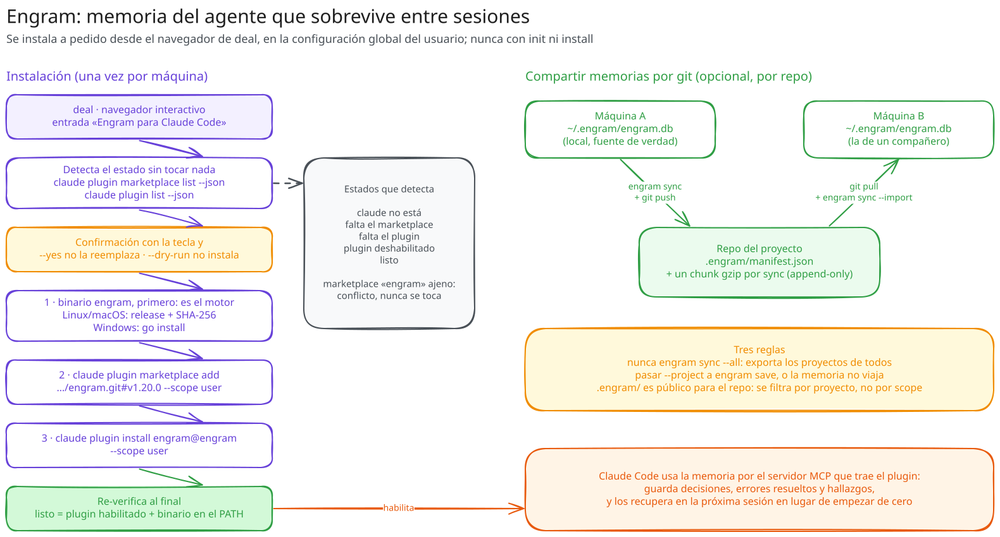

# Engram: memoria persistente del agente

**En resumen:** Engram le da a Claude Code memoria que sobrevive entre
sesiones. `deal` lo instala a pedido — nunca como parte de `init` o `install`
— porque escribe en la configuración global del usuario, no en el proyecto.
Es la única instalación del CLI que queda fuera de `kit.yaml`.



## Qué es y por qué

Sin memoria persistente, cada sesión de Claude Code parte de cero: decisiones
de arquitectura, convenciones acordadas a mitad de una conversación,
gotchas ya descubiertos — todo eso se pierde al cerrar la sesión. Engram es un
plugin de Claude Code (con su propio binario) que guarda esas memorias en una
base SQLite local y las recupera cuando hacen falta.

## Qué instala `deal`

La entrada **"Engram para Claude Code"** del navegador interactivo (nunca
`init`/`install`, que solo tocan el proyecto) hace dos cosas, en este orden:

1. **El binario `engram` primero.** Es el motor: tanto el servidor MCP del
   plugin como todos sus hooks invocan `engram`, así que instalar el plugin
   antes dejaría una ventana donde Claude Code arranca y cada hook falla. En
   Linux y macOS se descarga el asset del release pineado (`.tar.gz`, solo
   `amd64`/`arm64`), con checksum obligatorio y escritura atómica (temp +
   rename). En Windows, si hay toolchain de Go en el `PATH`, se prefiere
   `go install`: es la recomendación de upstream, porque Defender y ESET marcan
   como falso positivo los binarios prebuilt sin firmar. En cualquier
   plataforma sin asset publicado se cae a `go install` si hay Go, y si no, el
   plan se bloquea con el motivo.
2. **El marketplace y el plugin**, vía el CLI `claude`:
   `plugin marketplace add <url>#v1.20.0 --scope user`, después
   `plugin install engram@engram --scope user --yes`. Todo a **alcance
   `user`** (global): una copia a alcance `project` es otra decisión y nunca
   hace que el install global parezca hecho.

`deal-kit` nunca edita los archivos de configuración de `claude` directamente
— todo pasa por subcomandos documentados del propio CLI `claude`, con
argumentos que son **constantes del paquete**, nunca datos de `kit.yaml`, un
flag o el entorno. Un instalador que toma sus argumentos de datos se puede
apuntar a otro repositorio con solo editar datos; este no puede.

## Por qué no es un artefacto de `kit.yaml`

Escribe en la configuración global del usuario (`~/.claude/`), no en el
proyecto. Por eso "Instalar todo" y `deal install` **nunca** lo incluyen —
`TestInstallNeverInstallsEngram` lo fija explícitamente — y por eso vive en su
propia pantalla de la TUI en vez de mezclarse con skills o componentes.

## La escalera de estados

`engram.Detect` (`tool/internal/engram/engram.go`) resuelve el estado sin
mutar nada:

| Estado | Significa |
|---|---|
| `StateClaudeMissing` | `claude` no está en el `PATH` |
| `StateMarketplaceMissing` | No hay ningún marketplace llamado `engram` registrado |
| `StateMarketplaceConflict` | Existe un marketplace `engram`, pero apunta a otro repositorio — **nunca se toca**: el nombre lo ocupó algo que configuró el usuario |
| `StatePluginMissing` | El marketplace es el correcto, pero el plugin no está instalado a alcance `user` |
| `StatePluginDisabled` | Instalado a alcance `user`, pero deshabilitado |
| `StateReady` | Marketplace, plugin y habilitación, todo correcto |

`StateUnknown` es un resultado aparte, no un peldaño de la escalera: una
consulta que falla o devuelve algo que el CLI se niega a interpretar. Se
reporta como desconocido en vez de adivinar "no instalado" — adivinar mal
haría que `deal` reintente agregar un marketplace que ya está ahí.

El binario cuenta aparte del estado del plugin: un `StateReady` sin `engram`
en el `PATH` no es una instalación que funcione (cada hook fallaría en
runtime), así que ese caso sigue produciendo un plan — solo para el binario.

## Flags

| Flag | Efecto sobre la instalación de Engram |
|---|---|
| `--dry-run` | Consulta y muestra el plan; la tecla `y` de la TUI no produce ninguna instalación |
| `--offline` | Permite las consultas (son lecturas locales) y bloquea cualquier paso que descargue. Un plan que solo habilita un plugin ya en disco **sí** se permite offline: no contacta nada |
| `--yes` | **No** saltea la confirmación de Engram — solo la tecla `y` de esa pantalla específica la da |

## Compartir memorias por git

La base de Engram (`~/.engram/engram.db`) es local por máquina. Dos comandos
la mueven a través de git, manteniendo esa base como fuente de verdad:

```sh
engram sync            # exporta las memorias DE ESTE proyecto a .engram/
git add .engram/ && git commit -m "chore: sync engram memories"

git pull               # en otra máquina, o la de un compañero
engram sync --import
```

La exportación es **por proyecto** (resuelve el proyecto desde el remoto git)
e **incremental**: escribe `.engram/manifest.json` más un chunk gzip por sync,
nombrado por hash — dos personas sincronizando el mismo día no chocan en git,
e importar dos veces no hace nada.

Tres reglas de seguridad, documentadas en el `README.md` raíz del kit:

- **Nunca correr `engram sync --all`** — quita el filtro de proyecto y expone
  la memoria de *todos* los proyectos en el repositorio donde se esté parado.
- **Pasar `--project` a `engram save`** — el CLI no detecta el proyecto solo
  (a diferencia de `sync`), y una memoria guardada sin ese flag es invisible
  para el sync. Las memorias que el agente guarda por sus tools MCP ya llevan
  el proyecto correcto.
- **Tratar `.engram/` como público al repositorio** — el sync filtra por
  proyecto, no por scope, así que una memoria `scope: personal` viaja con él
  igual.

Compartir por git es opt-in por repositorio: uno que nunca commitea `.engram/`
mantiene cada memoria local a su máquina.

## Riesgos aceptados

| Riesgo | Detalle | Por qué queda así |
|---|---|---|
| `MarketplaceTag = "v1.20.0"` es un tag mutable | Quien controle el repositorio del marketplace puede reapuntarlo a otro commit | `claude plugin marketplace add <url>#<ref>` solo acepta ramas y tags como `<ref>` — un SHA de 40 caracteres da `Remote branch not found`, verificado reproduciendo el clon fuera de `claude`. Es lo más fuerte que la interfaz permite hoy |
| En Windows, los hooks del plugin son scripts de shell | Sin Git Bash o WSL, el plugin se instala pero nunca corre | Es un requisito del propio plugin; `deal` lo advierte al terminar la instalación en Windows |
| El checksum verifica transporte, no procedencia | `checksums.txt` se descarga del **mismo release** que el asset: detecta un asset truncado o un intermediario, pero no a quien controle el release | Se cierra con lo mismo que hoy no existe: una firma con una clave que no viva en el release |

Ninguno de los dos es un TODO abierto para "arreglar después": son los límites
de lo que la interfaz de `claude` y el modelo de distribución de GitHub
permiten hoy, documentados para que nadie los reintroduzca pensando que son un
descuido.

## Siguiente paso

[`07-guia-de-demo.md`](07-guia-de-demo.md) incluye Engram como paso opcional
del guion de demo.
